# **solution:**

**Objective:**

Extract 5 flags from a Windows memory dump:

1. Malware family
2. vHash of the malware
3. Username of the hacker
4. Flag 2 (derived from attacker actions)
5. Flag 3 (derived from attacker actions)

---

### 🕵️ Step 1: Process Enumeration with Volatility3

I began the investigation using Volatility’s `windows.pslist` plugin to inspect active processes at the time the memory snapshot was taken.

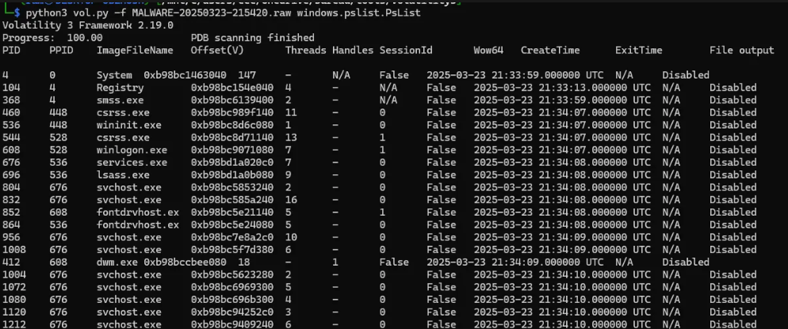

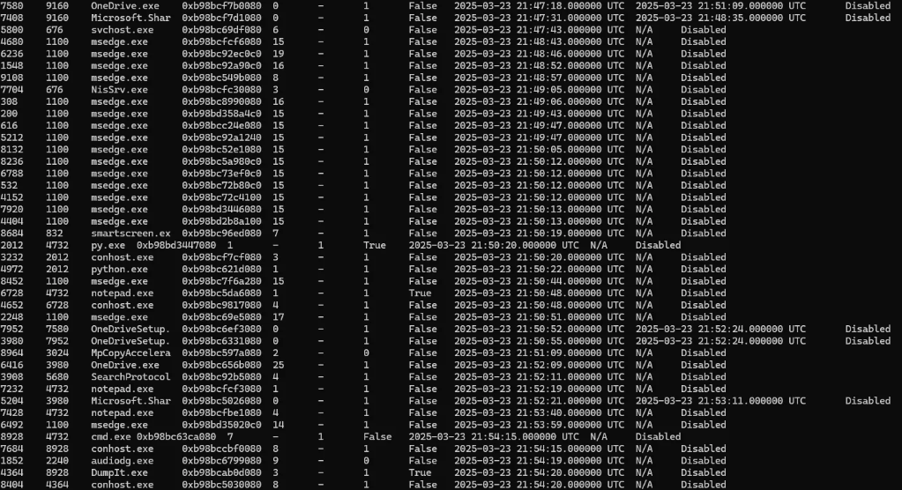

Among the listed processes, a few caught my attention due to their context or unexpected presence:

* `notepad.exe`
* `msedge.exe`
* `python.exe`

These are not inherently malicious, but in the context of memory forensics, they warranted further inspection.

---

### 📌 Step 2: Retrieve Full Command Lines

Using `windows.cmdline`, I retrieved the full paths and arguments of the suspicious processes.

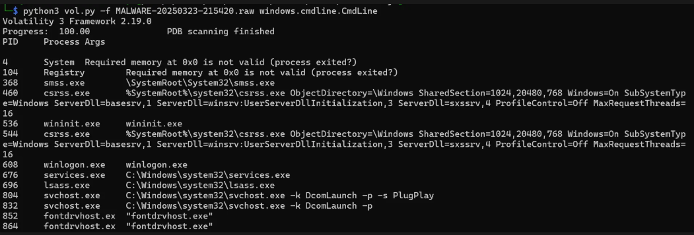

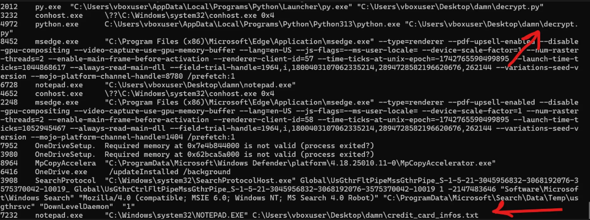

I confirmed:

* `python.exe` was executing a script (suggests custom malware or data processing).
* `notepad.exe` was running from a suspicious directory, not the default Windows path.

---

### 🧰 Step 3: Mount Memory Dump with MemProcFS

To make analysis easier and quickly access dropped files and process binaries, I used  **MemProcFS** .

> 📎 **Resource:** [MemProcFS GitHub](https://github.com/ufrisk/MemProcFS)

After launching `MemProcFS.exe`, it created a virtual disk that exposed the memory's file system.

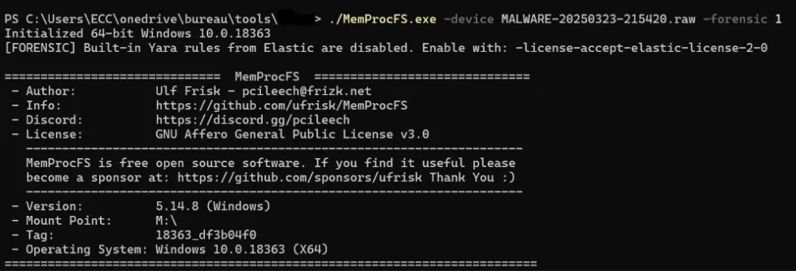

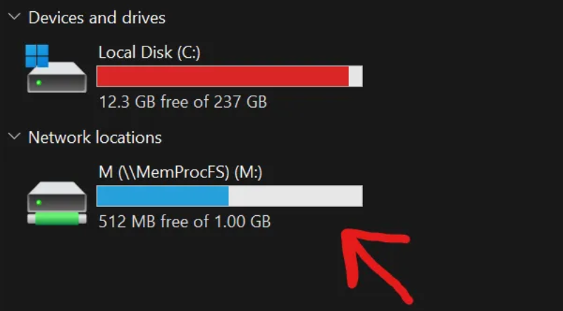

###### navigate to :

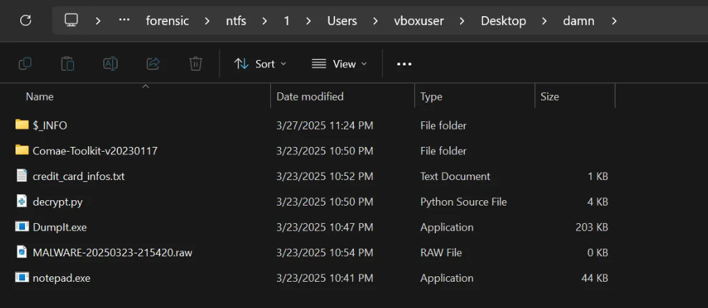

I extracted the binary of `notepad.exe` and uploaded it to  **VirusTotal** .

---

### 🦠 Step 4: Malware Identification

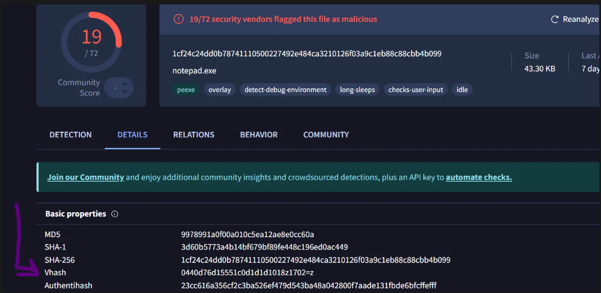

**VirusTotal Report:**

* The file was flagged as  **malicious** .
* The **vHash** was listed in the Details section.

> ✅ **Flag 1 – vHash of the malware:** Extracted from VirusTotal
>
> ✅ **Flag 2 – Malware Family:** Based on the behavior (encrypting user files), it was clear this was a **ransomware** sample.

---

### 🔍 Step 5: Static Analysis for Hacker Identity

Using **Binary Ninja** to statically analyze the binary, I looked at the `main()` function and found a strange encoded string.

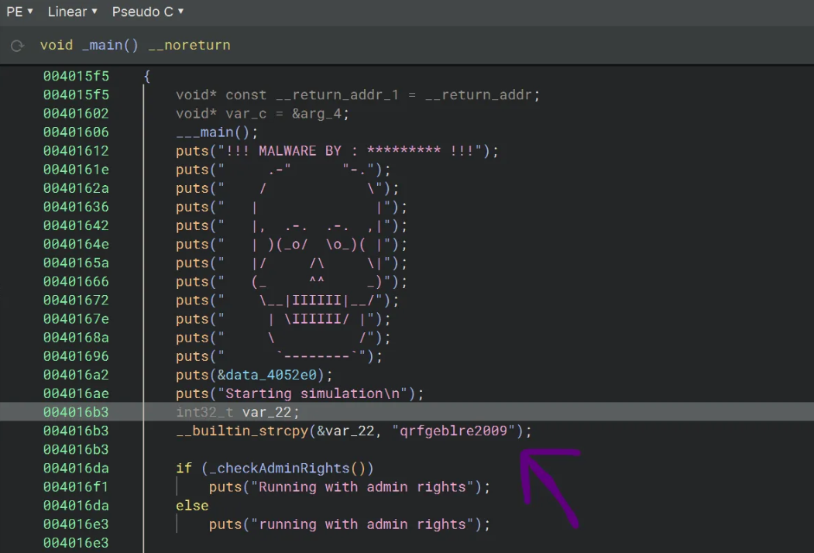

After testing in  **CyberChef** , `ROT13` decoding revealed:

> `destroyer2009`

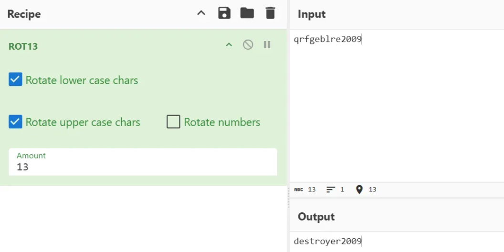

A quick lookup confirmed that **destroyer2009** is a known alias of a real-world hacker.

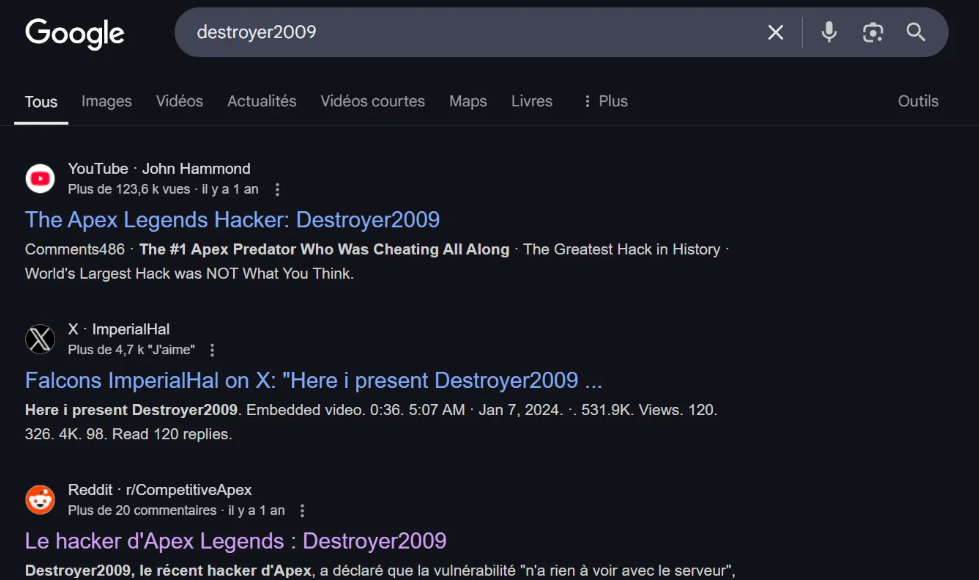

> ✅ **Flag 3 – Hacker username:** `destroyer2009`

---

### 🌐 Step 6: Web Activity Analysis

Back in the mounted memory dump, I explored the browser cache under:

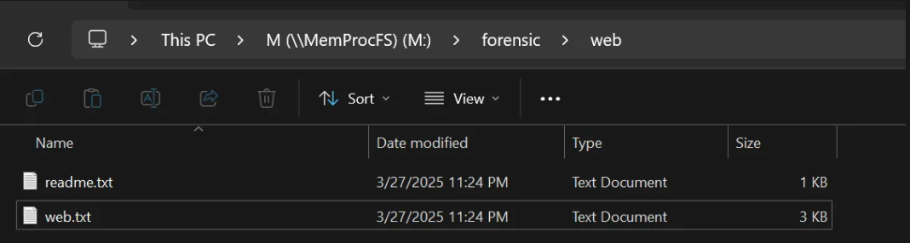

I found a file named `web.txt` which contained a Pastebin URL.

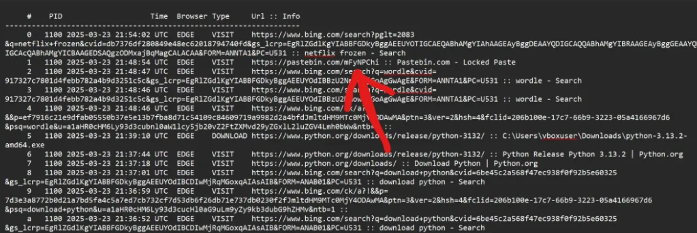

Upon visiting the URL, I discovered a **hex-encoded** message.

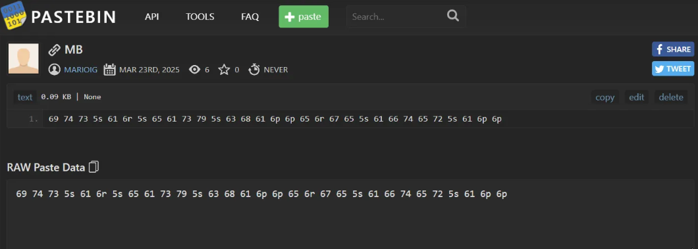

Decoded via CyberChef (Hex → UTF-8):

> `it_an_easy_challenge_after_all`

> ✅ **Flag 4 – Pastebin discovery**

---

### 🔐 Step 7: Finding the Final Flag – Encrypted Credentials

In the memory dump, I found a file that appeared to be encrypted credentials. At first glance, I couldn’t decrypt it.

Then I remembered the attacker ran a `decrypt.py` script (found in memory). Running it revealed an AES-encrypted blob.

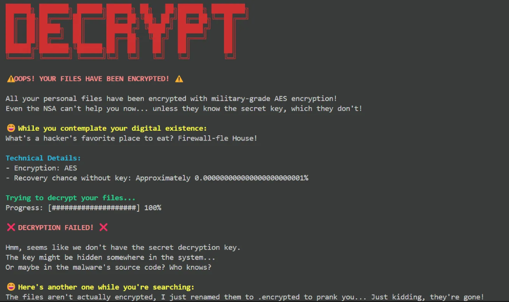

**Clue from the challenge description:**

> "The hacker loves everything that has 'important' in it."

Using strings on the memdump:

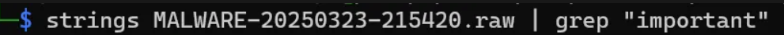

This revealed:

> “I’ve used this to encrypt an important f…”

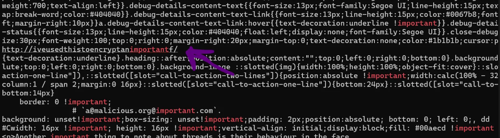

This was the  **encryption key** .

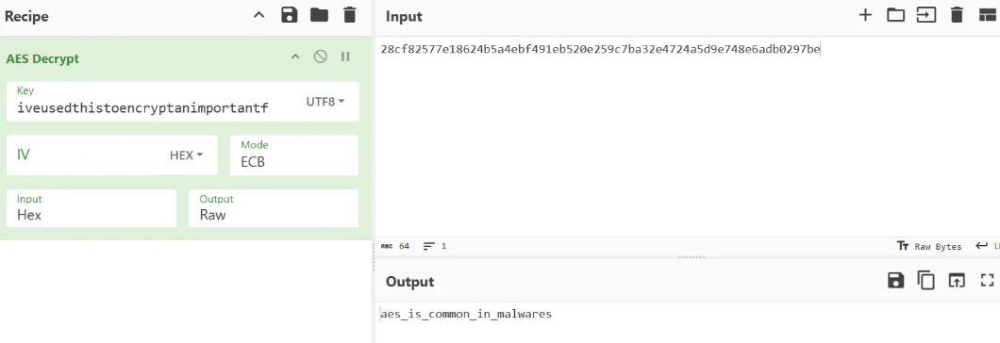

✅ **Flag 5 – encrypted Credentials**

---

## ✅ Final Flag Summary

| Flag # | Description              | Value                                  |
| ------ | ------------------------ | -------------------------------------- |
| 1      | Malware vHash            | From VirusTotal                        |
| 2      | Malware Family           | Ransomware                             |
| 3      | Hacker Username          | `destroyer2009`                      |
| 4      | Attacker’s Web Activity | `it_an_easy_challenge_after_all`     |
| 5      | Decrypted Credentials    | Extracted using AES + key from strings |

---

## 🧪 Tools & Resources Used

* **Volatility 3 :https://github.com/volatilityfoundation/volatility3**
* **MemProcFS** – Mounting memory dump : https://github.com/ufrisk/MemProcFS
* **VirusTotal** – Malware analysis : https://www.virustotal.com/
* **Binary Ninja** – Static analysis
* **CyberChef** – Decoding/Decryption : https://gchq.github.io/CyberChef/
* vol cheatsheet : https://blog.onfvp.com/post/volatility-cheatsheet/

---
